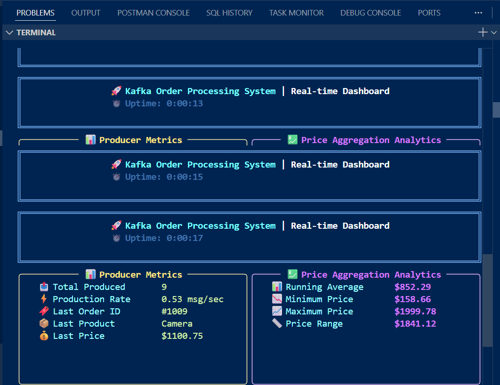
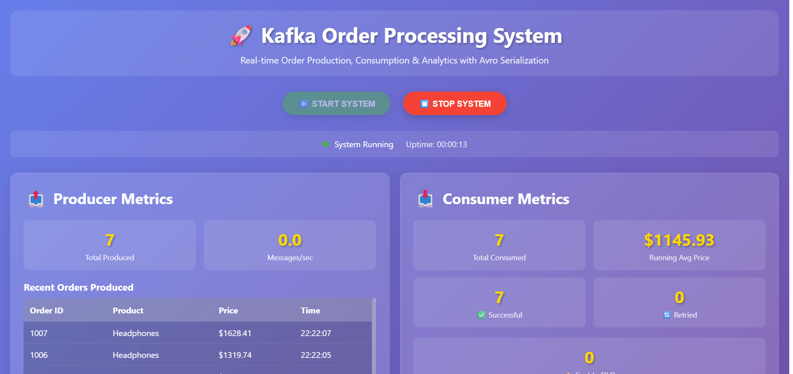

# Kafka Order Processing System

**Student:** EG/2020/3833  
**Assignment:** Real-time Order Processing with Apache Kafka

---

## 📋 Project Overview

This project implements a **real-time order processing system** using Apache Kafka with Avro serialization. The system demonstrates enterprise-grade message streaming with producer-consumer architecture, including advanced features like retry logic, Dead Letter Queue (DLQ), and real-time price aggregation.

### ✨ Key Features

- ✅ **Avro Serialization** - Schema-based message serialization using Confluent Schema Registry
- ✅ **Real-time Aggregation** - Running average calculation of order prices
- ✅ **Retry Logic** - Automatic retry mechanism with exponential backoff (up to 3 attempts)
- ✅ **Dead Letter Queue (DLQ)** - Failed messages are sent to DLQ after maximum retries
- ✅ **Web-based Dashboard** - Beautiful Flask UI for real-time monitoring
- ✅ **Docker Compose** - Complete containerized setup for Kafka ecosystem

---

## 🏗️ System Architecture

```
┌─────────────┐      ┌──────────────┐      ┌─────────────┐
│   Producer  │─────▶│ Kafka Broker │─────▶│  Consumer   │
│  (Python)   │      │   (orders)   │      │  (Python)   │
└─────────────┘      └──────────────┘      └─────────────┘
                            │                      │
                            ▼                      ▼
                    ┌──────────────┐      ┌─────────────┐
                    │Schema Registry│      │  orders-dlq │
                    │  (Avro)      │      │   (Topic)   │
                    └──────────────┘      └─────────────┘
```

### Components

1. **Zookeeper** - Manages Kafka cluster metadata
2. **Kafka Broker** - Message broker for order streaming
3. **Schema Registry** - Manages Avro schemas for message serialization
4. **Producer** - Generates random order messages
5. **Consumer** - Processes orders with aggregation and error handling
6. **Flask Web UI** - Real-time monitoring dashboard

---

## 📦 Order Message Schema

```json
{
  "type": "record",
  "name": "Order",
  "namespace": "com.kafka.orders",
  "fields": [
    {"name": "orderId", "type": "string"},
    {"name": "product", "type": "string"},
    {"name": "price", "type": "float"}
  ]
}
```

### Sample Order
```json
{
  "orderId": "1001",
  "product": "Laptop",
  "price": 1299.99
}
```

---

## 🚀 Getting Started

### Prerequisites

- Docker Desktop (Windows 11)
- Python 3.11+
- Git

### Installation

1. **Clone the repository**
```bash
git clone https://github.com/Asam8385/Kafka_assignment_3833.git
cd kafka_assignment
```

2. **Install Python dependencies**
```bash
pip install -r requirements.txt
```

3. **Start Kafka ecosystem with Docker Compose**
```bash
docker-compose up -d
```

This will start:
- Zookeeper (port 2181)
- Kafka Broker (port 9092)
- Schema Registry (port 8081)

4. **Verify services are running**
```bash
docker-compose ps
```

---

## 🎮 Running the Application

### Option 1: Web Dashboard (Recommended)

1. **Start the Flask web application**
```bash
python src/app.py
```

2. **Open your browser**
```
http://localhost:5000
```

3. **Click "START SYSTEM"** to begin producing and consuming orders

4. **Monitor real-time metrics:**
   - Producer: Total produced, recent orders
   - Consumer: Total consumed, running average price, successful/retried/DLQ counts

### Option 2: Standalone Components

**Run Producer only:**
```bash
python src/producer.py
```

**Run Consumer only:**
```bash
python src/consumer.py
```

**Run Terminal Dashboard:**
```bash
python src/dashboard.py
```

---

## 📊 Dashboard Screenshots

### System Running - Real-time Metrics


### Live Order Processing


The dashboard displays:
- **Producer Metrics**: Total orders produced, production rate, recent orders table
- **Consumer Metrics**: Total consumed, running average price, success/retry/DLQ counts
- **Recent Orders**: Live table showing processed orders with status badges
- **System Status**: Uptime counter and connection status

---

## 🔧 Configuration

### Kafka Configuration (`docker-compose.yml`)

```yaml
services:
  zookeeper:
    image: confluentinc/cp-zookeeper:7.5.0
    ports: ["2181:2181"]
    
  kafka:
    image: confluentinc/cp-kafka:7.5.0
    ports: ["9092:9092"]
    
  schema-registry:
    image: confluentinc/cp-schema-registry:7.5.0
    ports: ["8081:8081"]
```

### Python Dependencies (`requirements.txt`)

```
confluent-kafka[avro]==2.3.0
avro-python3==1.10.2
rich==13.7.0
fastavro==1.9.0
flask==3.0.0
flask-socketio==5.3.5
python-socketio==5.10.0
```

---

## 🎯 Features Implementation

### 1. Avro Serialization

- **Schema Definition**: `schemas/order.avsc`
- **Schema Registry Integration**: Automatic schema registration and versioning
- **Serialization**: Producer serializes orders to Avro format
- **Deserialization**: Consumer deserializes Avro messages back to Python objects

### 2. Real-time Aggregation

```python
# Running average calculation
self.running_average = sum(self.price_history) / len(self.price_history)
```

- Maintains last 100 prices in memory
- Calculates running average after each successful order
- Updates displayed in real-time on dashboard

### 3. Retry Logic

```python
# Exponential backoff retry
retry_count = self.retry_count.get(order_id, 0)
if retry_count < self.max_retries:
    time.sleep(2 ** retry_count)  # 2s, 4s, 8s
    # Retry processing
```

- **Maximum retries**: 3 attempts
- **Backoff strategy**: Exponential (2s, 4s, 8s)
- **Failure simulation**: 10% random failure rate for demonstration

### 4. Dead Letter Queue (DLQ)

- Failed messages after 3 retries → `orders-dlq` topic
- Includes error metadata and timestamp
- Prevents message loss
- Allows manual inspection and reprocessing

---

## 📈 System Metrics

The dashboard tracks and displays:

### Producer Metrics
- Total orders produced
- Production rate (messages/sec)
- Recent orders with details (Order ID, Product, Price, Timestamp)

### Consumer Metrics
- Total orders consumed
- Successful processing count
- Retry attempts count
- DLQ message count
- Running average price (real-time aggregation)
- Recent processed orders with status

---

## 🧪 Testing

### Simulated Failures

The consumer simulates random failures (10% rate) to demonstrate:
- Retry mechanism in action
- Exponential backoff
- DLQ routing after max retries

### Example Console Output

```
2025-11-21 22:16:45,641 - src.consumer - INFO - Processed order: 1003 - Smartphone - $1871.54
2025-11-21 22:16:45,641 - src.consumer - INFO - Running average: $1871.54
2025-11-21 22:16:46,349 - src.consumer - ERROR - Error processing order 1005: Simulated temporary processing failure
2025-11-21 22:16:46,349 - src.consumer - INFO - Retrying order 1005 (attempt 1/3)
```

---

## 🛠️ Troubleshooting

### Issue: Schema Registry not available
```bash
# Check if schema registry is running
docker logs schema-registry

# Restart services
docker-compose restart schema-registry
```

### Issue: Kafka connection failed
```bash
# Check Kafka broker status
docker logs kafka

# Verify Kafka is listening
netstat -an | findstr 9092
```

### Issue: UI not updating
- Refresh browser (F5)
- Check browser console for errors
- Verify Flask server is running
- Ensure system is started via "START SYSTEM" button

---

## 📁 Project Structure

```
kafka_assignment/
├── docker-compose.yml          # Kafka ecosystem configuration
├── requirements.txt            # Python dependencies
├── README.md                   # This file
├── schemas/
│   └── order.avsc             # Avro schema definition
├── src/
│   ├── producer.py            # Kafka producer implementation
│   ├── consumer.py            # Kafka consumer with retry/DLQ
│   ├── dashboard.py           # Terminal-based dashboard
│   ├── app.py                 # Flask web application
│   └── templates/
│       └── index.html         # Web dashboard UI
└── screenshots/               # Dashboard screenshots
    ├── dashboard_running.png
    └── order_processing.png
```

---

## 🔍 Key Implementation Details

### Producer (`src/producer.py`)
- Generates random orders from product catalog
- Uses AvroSerializer for message serialization
- Implements delivery callbacks for confirmation
- Configures acknowledgment and retry settings

### Consumer (`src/consumer.py`)
- Subscribes to `orders` topic
- Deserializes Avro messages
- Implements retry logic with tracking
- Sends failed messages to DLQ
- Calculates running average in real-time
- Manual offset commit after successful processing

### Web Application (`src/app.py`)
- Flask server with SocketIO
- Background threads for producer/consumer
- RESTful API for metrics polling
- Real-time updates every 500ms
- Start/Stop system controls

---

## 📚 Technologies Used

| Technology | Version | Purpose |
|------------|---------|---------|
| Apache Kafka | 7.5.0 | Message streaming platform |
| Confluent Schema Registry | 7.5.0 | Avro schema management |
| Python | 3.12 | Programming language |
| Flask | 3.0.0 | Web framework |
| Flask-SocketIO | 5.3.5 | Real-time communication |
| confluent-kafka | 2.3.0 | Kafka client library |
| Docker | Latest | Containerization |

---

## 🎓 Assignment Requirements Compliance

| Requirement | Implementation | Status |
|-------------|----------------|--------|
| Avro Serialization | Schema Registry + AvroSerializer/Deserializer | ✅ Complete |
| Real-time Aggregation | Running average of prices | ✅ Complete |
| Retry Logic | 3 retries with exponential backoff | ✅ Complete |
| Dead Letter Queue | orders-dlq topic for failed messages | ✅ Complete |
| Live Demonstration | Web-based dashboard with metrics | ✅ Complete |
| Git Repository | GitHub with full source code | ✅ Complete |

---

## 👤 Author

**Student ID:** EG/2020/3833  
**Repository:** https://github.com/Asam8385/Kafka_assignment_3833

---

## 📝 License

This project is created for educational purposes as part of a university assignment.

---

## 🙏 Acknowledgments

- Apache Kafka documentation
- Confluent Platform guides
- Flask and SocketIO communities

---

## 📞 Support

For questions or issues, please create an issue in the GitHub repository.

---

**Last Updated:** November 21, 2025